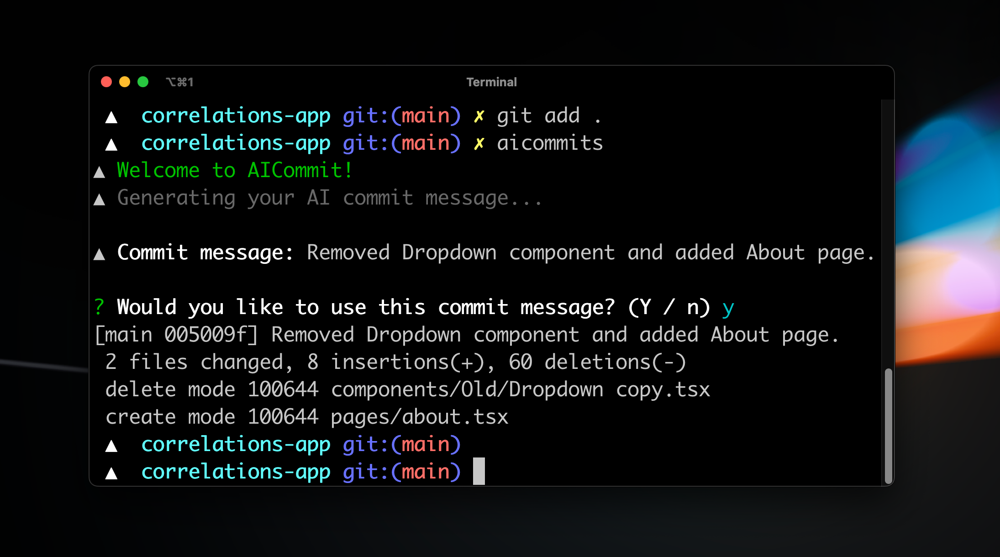

# AI Commit

Have AI Commit write your git commit messages for you so you never have to write a commit message again.

## How to install

1. Run `npm i -g zx` (this CLI uses zx)
2. Run `git clone github.com/nutlope/aicommit` in your root directory
3. Add a file called `.env.json` in the folder with your OpenAI API key. You can get this by [signing up](https://openai.com/api/)
4. [Optional] If you're on mac, add `alias aicommit="zx ~/ai-commit/aicommit.mjs"` to your `.zshrc` so you can trigger the program simply by typing `aicommit`

**Note:** The process to install this will get vastly simplified when I rewrite this CLI and publish it as an npm package to be run with `npx`.

## How it works

This project uses a command line interface tool called zx that's developed by google. In the script, it runs a `git diff` command to grab all the latest changes, sends this to OpenAI's GPT-3, then returns the AI generated commit message. Video coming soon where I rebuild it from scratch to show you how to easily build your own CLI tools powered by AI. Fully privacy friendly as commands only run on your local machine using your OpenAI account.

This CLI also supports conventional commits. If you want conventional commits, simply set the `conventionalCommit` variable at the top of the script to `true`.

## Remaining tasks

Now:

- [ ] Rewrite this in node to publish as an npm package
  - [ ] Figure out how to fail gracefully instead of exit 1
  - [ ] Try openai curie And/OR codex

After:

- [ ] Look into better conventional commit support, look at other CLIs
- [ ] Try supporting more than 200 lines by grabbing the diff per file
- [ ] Build landing page
